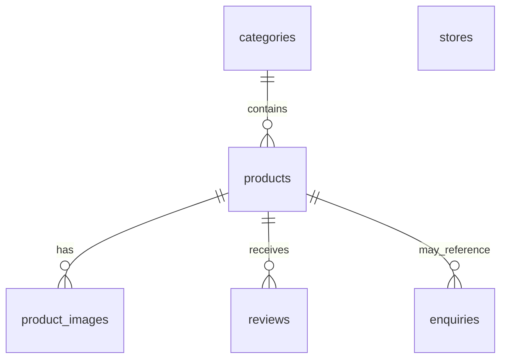

# Database Schema

This document describes the deployed Supabase/PostgreSQL schema for the Tiles Digital Platform. The linked project database contains the deployed schema and fictional Timeless Tiles demo categories, products, stores, and reviews. Product images and enquiries remain empty by design at this stage.

## Entities and responsibilities

- **`categories`** groups the catalogue into active, ordered tile categories such as floor, wall, bathroom, kitchen, and outdoor tiles.
- **`products`** holds the primary sellable-tile information: SKU, category, descriptions, price, dimensions, colour, finish, material, stock state, applications, and rooms.
- **`product_images`** holds ordered product imagery. Its partial unique index allows at most one primary image per product.
- **`reviews`** stores customer feedback. A review is unapproved by default and requires dashboard approval before it is publicly visible.
- **`stores`** supports the future store finder with address, contact, coordinates, opening hours, and active status.
- **`enquiries`** stores contact, quote, product, bulk, and wholesale requests. It can optionally reference a product.

## Important fields

| Table | Key fields | Purpose |
| --- | --- | --- |
| `categories` | `name`, `slug`, `sort_order`, `is_active` | Provides stable, ordered catalogue groupings and public visibility control. |
| `products` | `category_id`, `sku`, `slug`, `price`, `size_label`, `colour`, `finish`, `material`, `applications`, `rooms`, `stock_status` | Powers unique product identity, catalogue content, filtering, availability, and recommendations. |
| `product_images` | `product_id`, `image_url`, `sort_order`, `is_primary` | Supports ordered galleries with at most one primary image for each product. |
| `reviews` | `product_id`, `customer_name`, `rating`, `comment`, `is_approved` | Captures moderated social proof for product pages. |
| `stores` | `slug`, address fields, contact fields, coordinates, `opening_hours`, `is_active` | Supplies location and contact data for the future store finder. |
| `enquiries` | optional `product_id`, `enquiry_type`, contact fields, `quantity`, `preferred_contact`, `status` | Records sales leads and their later follow-up status. |

## Entity relationship diagram

## Important relationships

- A product belongs to one category. Category deletion is restricted while products reference it.
- Product image and review records cascade-delete with their product because they have no useful standalone meaning.
- Enquiries use `ON DELETE SET NULL` for `product_id`, preserving historical sales enquiries even if a product is removed.
- Stores are independent entities because a store does not belong to a single product or category.

## Filtering and recommendations

Advanced filtering will use `size_label`, `colour`, `finish`, `material`, `price`, and the `applications` array. GIN indexing supports planned filtering of `applications` and `rooms`.

Room-wise recommendations will use `products.rooms`, allowing products to be associated with rooms such as living room, bedroom, bathroom, kitchen, balcony, outdoor, and commercial settings without fixing the list permanently in a database constraint.

## Security and RLS

All six public-schema tables enable Row Level Security. The migration revokes the default client-role privileges from both `anon` and `authenticated`, then grants back only the operations needed by the public application.

- Active categories, active products, images of active products, approved reviews, and active stores are publicly readable.
- Public review submissions can insert only `product_id`, `customer_name`, `rating`, `title`, and `comment`. They cannot write `id`, timestamps, or `is_approved`; the RLS policy additionally requires `is_approved = false`.
- Public enquiries can insert only the user-supplied enquiry columns. They cannot set `id`, timestamps, or `status`; the RLS policy requires the default `status = 'new'`.
- Enquiries are never readable, editable, or deletable by client roles.
- There are no public update or delete grants on any table.

The public application uses the Supabase publishable key with RLS. No `service_role` or secret key belongs in frontend code. Administrative content management for this academic project remains in the Supabase dashboard.

## Project requirement support

The schema supports the product catalogue, category browsing, image galleries, advanced filters, room recommendations, customer reviews, store finder, quote/contact workflows, and historical lead tracking. The 40-product database catalogue requirement is satisfied with demo data; customer-facing catalogue UI and product image assets remain future work.

## Migration and type-generation workflow

The linked Supabase schema is the project database schema. The generated [`Database` type](../src/types/database.types.ts) is produced from that deployed schema and is used by both Supabase client helpers.

The deployed `20260928000000_initial_schema.sql` and `20260928231512_seed_catalogue.sql` migrations are immutable. Future schema changes must use new timestamped migration files; do not edit migration history after deployment. See [Final Project Report](FINAL_PROJECT_REPORT.md) for dataset conventions.
