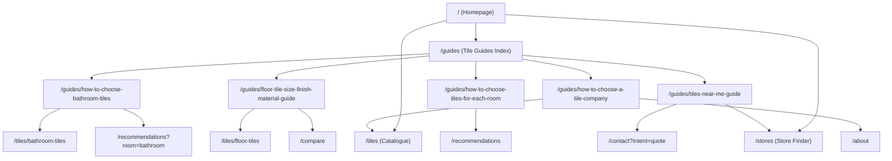

# SEO Keyword & Content Strategy Document

## 1. Overview & Strategy Intent
This document outlines the keyword mapping, search intent classification, content architecture, and claim-safety guidelines for the **Timeless Tiles Digital Platform**.

> [!NOTE]
> **Academic Transparency Notice**: No commercial keyword research tools (e.g., Ahrefs, SEMrush) or paid Google Ads API data were used. Search volume numbers, CPC rates, and keyword difficulty scores are intentionally not fabricated. Keywords and search intent classifications represent standard SEO methodology adapted for an academic demonstration platform.

---

## 2. Search Intent Classification System
Target search terms are categorized into four standard search intent types:
1. **Informational**: Users seeking educational guidance, specification standards, tile selection advice, or room suitability criteria.
2. **Commercial Investigation**: Users exploring tile types, comparing materials/finishes, or evaluating supplier options before purchasing.
3. **Local / Navigation**: Users looking for showroom addresses, directions, store hours, or local availability.
4. **Transactional / Lead Generation**: Users seeking price quotes, formal enquiries, or specific product ordering.

---

## 3. Master Keyword-to-Page Mapping

| Keyword / Search Term | Search Intent | Target Route | Content Role | Primary Internal Links | Claim-Safety & Context Notes |
|---|---|---|---|---|---|
| `tiles` | Informational / Commercial | `/tiles` | Main Catalogue Index | Categories, Guides, Compare | Core brand/catalogue target. |
| `tile catalogue` | Commercial Investigation | `/tiles` | Full product directory | Categories, Filter options | Displays 40-product catalogue. |
| `floor tiles` | Commercial Investigation | `/tiles/floor-tiles` | Category Catalogue | Floor Guide, Compare, Living Room Recs | Derived from 12 floor products. |
| `wall tiles` | Commercial Investigation | `/tiles/wall-tiles` | Category Catalogue | Bathroom/Kitchen Categories | Derived from 10 wall products. |
| `bathroom tiles` | Commercial Investigation | `/tiles/bathroom-tiles` | Category Catalogue & Guide | Bathroom Guide, Recommendations, Quote | Detailed wet-area focus. |
| `kitchen tiles` | Commercial Investigation | `/tiles/kitchen-tiles` | Category Catalogue | Backsplash & Floor catalogue | Focus on grease/cleanability. |
| `outdoor tiles` | Commercial Investigation | `/tiles/outdoor-tiles` | Category Catalogue | Balcony & Patio recommendations | Focus on textured slip grip. |
| `tile finishes` | Informational | `/guides/floor-tile-size-finish-material-guide` | Informational Guide | Floor Catalogue, Compare | Explores matte, glossy, carved finishes present in dataset. |
| `tile sizes` | Informational | `/guides/floor-tile-size-finish-material-guide` | Informational Guide | Catalogue Filters | Explores 600x600, 600x1200, 800x800 catalogue sizes. |
| `tile materials` | Informational | `/guides/floor-tile-size-finish-material-guide` | Informational Guide | Floor Catalogue | Discusses porcelain, vitrified, and ceramic materials. |
| `room-wise tile selection` | Informational | `/guides/how-to-choose-tiles-for-each-room` | Informational Guide | `/recommendations`, Categories | Highlights transparent tag matching. |
| `tile recommendations` | Commercial Investigation | `/recommendations` | Interactive Tool | Room Guides, Compare, Categories | Dynamic tag-based filter tool. |
| `compare tiles` | Commercial Investigation | `/compare` | Comparison Matrix | Product Detail Pages, Guides | Multi-attribute spec comparison. |
| `tiles near me` | Local / Navigation | `/guides/tiles-near-me-guide` & `/stores` | Informational Guide & Store Finder | `/stores`, Store detail pages, Contact | Fictional demo store locations; clearly disclosed as academic material. |
| `best tiles company` | Informational / Commercial | `/guides/how-to-choose-a-tile-company` | Informational Guide | `/about`, `/tiles`, `/compare`, Quote | Solves search intent by providing objective evaluation criteria without claiming Timeless Tiles is superior. |
| `tile quote` / `request tile price` | Transactional / Lead-Gen | `/contact?intent=quote` | Lead Form | Catalogue, Cart/Enquiry | Triggers quote intent pre-selection. |

---

## 4. Content Claim-Safety Rules

### "Best Tiles Company" Search Term Handling
- **Allowed Approach**: Target the concept informationally by guiding users on *how* to evaluate tile suppliers (range breadth, specification clarity, pricing transparency, sample access, verified reviews).
- **Prohibited Claims**: Never state or imply that *"Timeless Tiles is the best tiles company"* or *"#1 tile manufacturer"*.

### "Tiles Near Me" Local Intent Handling
- **Allowed Approach**: Provide a local store evaluation guide explaining what buyers should inspect when visiting nearby tile showrooms.
- **Prohibited Claims**: Never claim that Timeless Tiles operates real physical showrooms near the user's location. Fictional demo store entries remain clearly labeled as academic material.

---

## 5. SEO Content & Internal Link Architecture

---

## 6. Verification & Academic Deliverables
- **Guides Created**: 5 comprehensive guide articles (700-1200 words each).
- **Canonical URLs**: Fully configured for `/guides` and all `/guides/[slug]` routes.
- **Sitemap**: Total static + dynamic URLs = 59 valid entries.
- **Structured Data**: BreadcrumbList JSON-LD emitted automatically across all guide routes.
