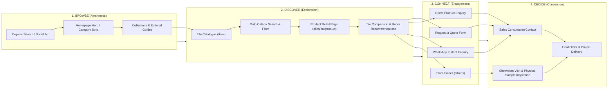

# Customer Journey Diagram

This document models the 4-stage customer journey (**Browse → Discover → Connect → Decide**) mapped to actual website features in the **Timeless Tiles Digital Platform**.

## Customer Journey Mapping Summary

| Journey Stage | Objective | Primary Website Feature / Route | Outcome |
| --- | --- | --- | --- |
| **1. Browse** | Capture initial interest and communicate brand quality | Homepage (`/`), Category Strip, Editorial Collections (`/collections`), Tile Guides (`/guides`) | Visitor lands on relevant page and begins exploring |
| **2. Discover** | Help visitor find products matching technical & aesthetic needs | Catalogue (`/tiles`), Multi-Criteria Filters, Comparison (`/compare`), Room Recommendations (`/recommendations`) | Visitor evaluates 2–3 suitable tiles |
| **3. Connect** | Convert visitor interest into direct sales lead | Quote Form (`/contact?intent=quote`), Product Enquiry (`/contact?intent=product`), WhatsApp Link, Store Finder (`/stores`) | Qualified lead stored in database or store contact initiated |
| **4. Decide** | Facilitate physical sample inspection & project quote closing | Showroom consultation, sales followup, sample review | Customer places final order |
