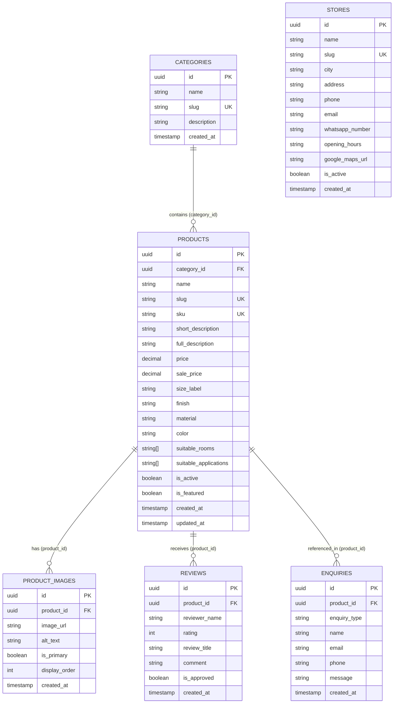

# Entity-Relationship (ER) Diagram

This document models the database schema for the **Timeless Tiles Digital Platform** deployed on Supabase PostgreSQL.

## Schema Entities Summary

1. **CATEGORIES (5 records):** High-level tile classifications (`floor-tiles`, `wall-tiles`, `bathroom-tiles`, `kitchen-tiles`, `outdoor-tiles`).
2. **PRODUCTS (40 active records):** Physical tile specifications including pricing, sale pricing, dimensions, material, finish, colour, suitable rooms, and application suitabilities.
3. **PRODUCT_IMAGES (40 primary records):** Image metadata linking products to local WebP presentation paths and SVG fallbacks.
4. **REVIEWS (24 approved records + pending submissions):** Product ratings and comments; default `is_approved = false` for moderation via Supabase Dashboard.
5. **STORES (3 active records):** Factual demo showroom records (`timeless-tiles-central`, `timeless-tiles-design-studio`, `timeless-tiles-trade-centre`).
6. **ENQUIRIES:** Public INSERT-only lead capture records storing quote requests, product enquiries, and general contact messages.
