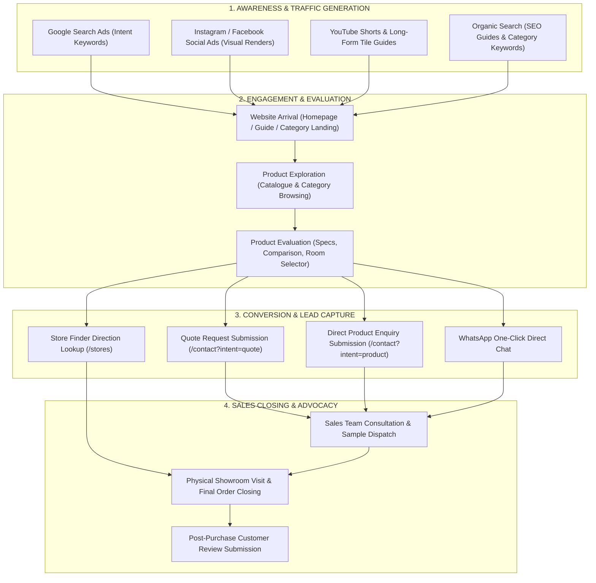

# Marketing Funnel Diagram

This document models the proposed 7-stage digital marketing funnel for the **Timeless Tiles Digital Platform**.

## Marketing Funnel Mapping Summary

| Funnel Stage | Traffic Source / Channel | Destination Route | Key Conversion Action |
| --- | --- | --- | --- |
| **Awareness** | Google Ads, Instagram/Facebook Ads, YouTube Shorts, Organic SEO | Homepage (`/`), Guide (`/guides/how-to-choose-bathroom-tiles`), Category pages | Page view & click-through |
| **Exploration** | Internal Site Navigation | Catalogue (`/tiles`), Offers (`/offers`), Collections (`/collections`) | Multi-filter selection, product view |
| **Evaluation** | Dynamic Product Tools | Comparison (`/compare`), Recommendations (`/recommendations`), Product Details | Compare tray addition, room preference match |
| **Conversion** | Lead Capture Modules | Contact/Quote Form (`/contact`), WhatsApp link, Store Finder (`/stores`) | Form submission, WhatsApp click, store lookup |
| **Closing & Advocacy** | Offline / Showroom | Physical showroom visit, sales call | Purchase completion, review submission |
