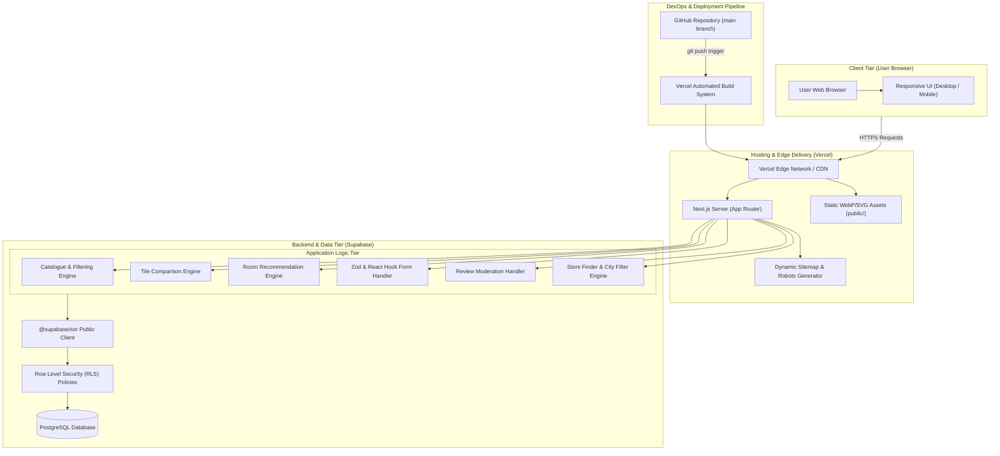

# System Architecture Diagram

This document presents the technical system architecture for the **Timeless Tiles Digital Platform**, a web application built using Next.js 16 (App Router), TypeScript, Tailwind CSS, Supabase PostgreSQL, and Vercel.

## Architecture Summary

1. **Client Tier:** Browsers interact with responsive Next.js pages rendered dynamically or statically.
2. **Hosting Tier:** Deployed on Vercel with automatic edge caching for static assets, WebP imagery, and dynamic Open Graph image generation.
3. **Application Tier:** Server and client components handle catalogue browsing, multi-criteria filtering, tile comparison persistence, deterministic room recommendations, form validation via Zod, and Store Finder queries.
4. **Database Tier:** Managed Supabase PostgreSQL backend using client-side `@supabase/ssr` with Row Level Security (RLS) ensuring strict public read access for active catalogue items/approved reviews, and INSERT-only permissions for lead enquiries and user reviews.
